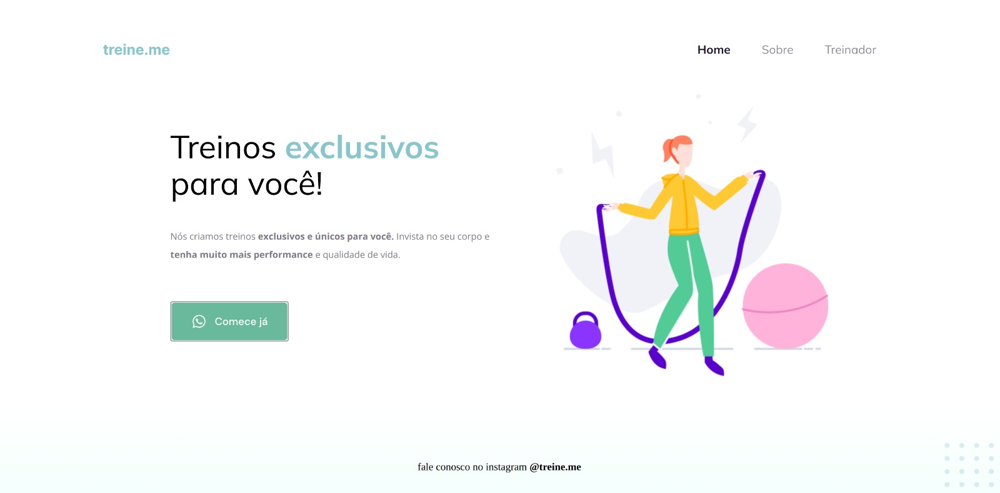
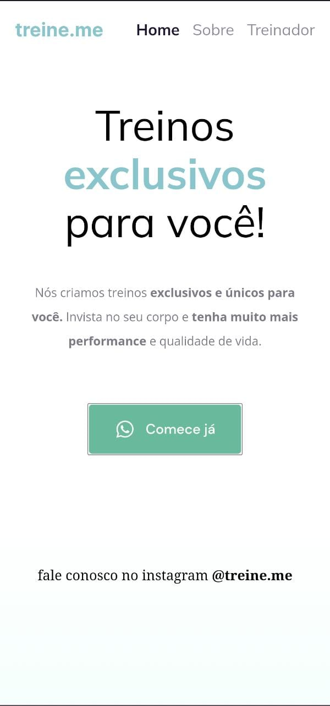

# 🔗LINKS
<a href="https://treinemee.netlify.app/"> Link 1:netlify</a> 
<a href="https://synxther.github.io/explorer-treine.me/"> Link 2:GitHub</a> 
<a href="https://explorer-treine-me.vercel.app/"> Link 3:Vercel</a>

# 💻Tecnologia
Este projeto foi desenvolvido em:

  
  

# layout do projeto:

<!-- <a href="https://www.figma.com/file/Eg7SEVZZwJ2l1sgSQtVNuR/Explorer---Projeto-01-(Copy)-(Copy)?type=design&node-id=1-2&t=6fPdWtFksBCaZvXt-0">📃 Link do projeto</a> -->

https://synxther.github.io/explorer-treine.me/
